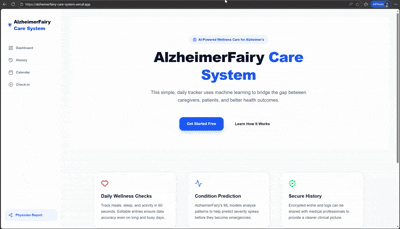

# STEMpower-Hacks 🛡️ AlzheimerFairy Care System

This project was created for the [STEMpower Hacks 2025 hackathon](https://stempower-her-hacks.devpost.com/).

## Demo

Try it out! [https://alzheimerfairy-care-system.vercel.app/](https://alzheimerfairy-care-system.vercel.app/)



Watch .MP4 Here: [AlzheimerFairy_Care_System.MP4](public/DEMO_AlzheimerFairy_Care_System.gif)

---

## 🛡️ AlzheimerFairy Care System

**TRACK**: HealthTech and Wellness

### TECH STACK:

- Typescript

- Tailwind CSS

- Lucide React

- Next.js

- Supabase

- Python

- Flask

- pandas

- NumPy

- Scikit-learn

- Vercel

- Render

- Gunicorn

### MOTIVATION: 

- **AUDIENCE**: Alzheimer patients & caregigvers

- **PROBLEM**: Caregivers for Alzheimer's patients often struggle to monitor subtle & daily fluctuations in behaviors, habits, nutrition, and incidents. 

- **PURPOSE**: 

  - Have a centralized platform where you can track your loved ones' daily habits, lifestyle factors, medical factors, and symptoms in a daily 'Check-in'
  
  - This raw data will be used to predict Alzheimer's severity and other health and wellness trends

  - Designed to bridge the gap between daily caregiving at home, and clinical physician oversight for patients with Alzheimer's and dementia.

---

### ✨ KEY FEATURES:

- **Daily Check-ins**: Track symptom severity, agitation, mood, memory and cognition, diet, health emergencies or incidents, and more!

- **Long-Term History**: A detailed snapshot of all daily check-ins, to quickly assess reported events and information.

- **Visual Care Calendar**: Uses dynamic labels and colors (Green/Amber/Red) to highlight incidents, medication intake, and reported severity.

- **Predictive Trend Analysis**: Identifies if symptoms are stabilizing or worsening, based on check-in history.

- **Multivariate Clinical Projection**: Uses Random Forest with Feature Engineering for predictive modeling and clinical projection, based on a Feature Set of multiple health markers (Physical, Behavioral, Compliance, and Target)

- **Emergency Flagging**: High-contrast alerts for critical behavioral incidents.

- **Detailed Physician Report**: Generates a 30-day clinical summary with automated trend labels (Improving/Declining). A high-fidelity & printable PDF summary can be given to a doctor to easily review.

- **Mobile-First Design**: Fully responsive for caregivers recording data on the go.

---

### USAGE:

#### Daily Logging

- Navigate to the **Check-in** tab.

- Input today's wellness check.
- Add specific details or observation notes as needed.

- Toggle the **Emergency** switch only if a significant incident occurred that a doctor must see.
  - Eg. sudden medical incident, hospitalization

#### Sharing with Doctors

- Open the **Physician Report** from the sidebar.

- Review the 30-day trend summary.

- **Print** or **Download PDF** of the Physician Report, to bring the report to the next clinical appointment.

#### Monitoring Trends

- Use the **Dashboard** for an AI-powered prediction on tomorrow's health severity based on recent data, and to view long-term trends.

- Use the **History** page to scroll through past notes.

- Use the **Calendar** for a bird's-eye view of the patient's well-being over the course of any month.


---

## Installation & Setup

0. Install all necessary dependencies; Create a [Supabase](https://supabase.com/) account; Create a new Supabase project

1. Clone the repository
```
git clone https://github.com/wong-ja/stempower-hacks
```

2. Create an `.env.local` file in the root directory and add your Supabase credentials (from the new project):

```
NEXT_PUBLIC_SUPABASE_URL=your_supabase_project_url
NEXT_PUBLIC_SUPABASE_ANON_KEY=your_supabase_anon_key
```

3. Create the `wellness_logs` table by running this in the Supabase SQL Editor

```
create table wellness_logs (
  id uuid default gen_random_uuid() primary key,
  checkin_date date default current_date,
  severity_rating integer check (severity_rating >= 1 and severity_rating <= 10),
  agitation_level integer check (agitation_level >= 1 and agitation_level <= 10),
  mood_rating integer check (mood_rating >= 1 and mood_rating <= 10),
  memory_score integer check (memory_score >= 1 and memory_score <= 10),
  meds_taken boolean default true,
  is_emergency boolean default false,
  notes text,
  meal_details text,
  created_at timestamp with time zone default timezone('utc'::text, now())
);
```

<br>

4. Run the app

```
npm run dev
```

- Open http://localhost:3000 to see the result.


---

## +

This is a [Next.js](https://nextjs.org) project bootstrapped with [`create-next-app`](https://nextjs.org/docs/app/api-reference/cli/create-next-app).

To learn more about Next.js, take a look at the following resources:

- [Next.js Documentation](https://nextjs.org/docs) - learn about Next.js features and API.
- [Learn Next.js](https://nextjs.org/learn) - an interactive Next.js tutorial.

You can check out [the Next.js GitHub repository](https://github.com/vercel/next.js) - your feedback and contributions are welcome!
